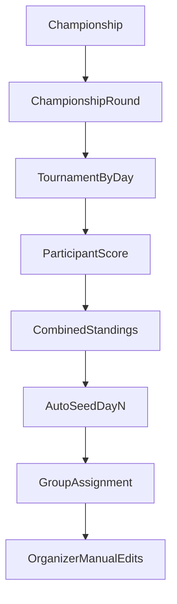

# ADR-0001: Multi-day Competitions via Championships Wrapper

_This document is an ADR entry in the Architecture Decision Log (ADL)._

## Status
Accepted

## Date
2026-04-27

## Context
- Most events are single-day tournaments and should keep using the current `Tournament` flow unchanged.
- Multi-day events are infrequent (around three per year) and should not increase complexity in the default tournament UI.
- We need:
  - per-day execution with existing round/group/score mechanics,
  - combined standings across days,
  - day 2+ pre-seeding from combined standings,
  - organizer override of pre-seeded groups,
  - late joins and participant drops handled explicitly.

## Decision
Implement multi-day events as a separate top-level concept named `Championship`, where each day is an existing `Tournament`.

### Core model
- Add `Championship`.
- Add `ChampionshipRound` with ordered links to `Tournament` (`dayOrder`, `tournamentId`).
- Use a single canonical relation (`ChampionshipRound.tournamentId -> Tournament.id`) and do not store a backward FK on `Tournament`.
- Add `ChampionshipRegistration` keyed by `membershipNo` for cross-day participant identity.
- Store `competitorNumber` on `ChampionshipRegistration` (unique within a championship) so the same competitor number carries across all rounds.
- Add `Participant.competitorNumber` as a tournament-scoped stable competitor identifier (`unique(tournamentId, competitorNumber)`).

### Modeling note
- The previous back-reference approach (`Tournament.championshipDayId`) was dropped to avoid dual-source-of-truth synchronization.
- Standalone tournaments are queried through relation-null checks (`championshipRound IS NULL`) instead of scalar `championshipDayId IS NULL`.

### Behavioral rules
- Day 1 groups are manual.
- Day 2+ groups are auto-seeded from combined standings using adjacent blocks:
  - example (`groupSize=4`): `1-4`, `5-8`, `9-12`.
- Tail handling:
  - rebalance tail blocks to maximize full groups,
  - if still impossible, allow a smaller final group (example: `1-4`, `5-7`).
- After auto-seed, organizers can fully edit groups in normal group assignment UI.
- Late join on day `N`:
  - default prior-day backfill is DNC (`setDNC`) for days `< N`.
- Drop handling:
  - no automatic DNC for later days,
  - organizer can run bulk action to set DNC on remaining days.

### Visibility rules
- Default tournament lists show only standalone tournaments by filtering tournaments with no linked `ChampionshipRound`.
- Championship day tournaments appear in `My Championships` (and direct links), not in normal tournament lists.

## Alternatives considered

### Rejected: Embed days inside `Tournament`
- Would require new day-specific score/group models and broad refactors in core tournament actions and screens.
- Higher regression risk for the primary single-day workflow.
- Larger PRs and harder review path.

## Consequences

### Positive
- Reuses existing tournament engine for each day (round formats, groups, scoring, publishing).
- Keeps default tournament workflows simple.
- Enables incremental rollout with low compatibility risk.

### Trade-offs
- Requires cross-day identity layer (`ChampionshipRegistration`).
- Needs orchestration logic for combined standings and seeding.

## Backward compatibility
- Existing tournaments remain standalone unless linked by a `ChampionshipRound` row.
- No breaking changes to core score/group actions for standard tournament flows.
- Championship behavior is introduced via new actions and UI surfaces.

## Implementation milestones (small reviewable slices)

### M1 — Schema foundation (no behavior change)
- Add schema objects:
  - `Championship`
  - `ChampionshipRound`
  - `ChampionshipRegistration`
- Add indexes for round lookups and championship ordering.
- Migration default: existing tournaments remain standalone by having no linked championship round rows.

### M2 — Championship actions (dark launch)
- Add championship CRUD + day attach/detach actions.
- Enforce transactional integrity on `ChampionshipRound` creation/removal with linked tournament references.
- Keep features non-discoverable in existing user flows.

### M3 — Standalone tournament list guardrail
- Update default list queries to relation-null (`championshipRound IS NULL`).
- Add explicit championship-scoped list queries for day tournaments.

### M4 — My Championships UI shell
- Add navigation entry and list/detail pages.
- Support day ordering and deep links to existing `/tournaments/[tId]` pages.

### M5 — Combined standings engine
- Add library and actions for combined standings (sum raw scores, current tie semantics).
- Use `membershipNo` identity mapping.

### Participant naming policy
- `membershipNo` is the stable championship identity.
- Display name in combined views uses the most recent known participant name (latest championship round containing that `membershipNo`), not a first-entry snapshot.
- `competitorNumber` for championship artifacts (badges/documents) comes from `ChampionshipRegistration` and remains stable across all championship rounds.
- `competitorNumber` is assigned by the system at championship registration time, using the next sequential number within that championship (`max + 1`), and is immutable afterward.

### M6 — Auto-seed and manual override
- Add day 2+ auto-seed (adjacent blocks + tail rebalance).
- Keep post-seed manual editing fully enabled in existing group UI.

### M7 — Late join / drop operations
- Add day-N participant add with prior-day DNC backfill.
- Add organizer bulk action to set DNC on remaining days after drops.

### M8 — Optional public championship results
- Add championship results page composing per-day and combined views.
- Keep existing tournament publish/share behavior unchanged.

### M9 — Hardening
- Add integration/regression coverage and runbook notes.
- Verify no regressions for standalone tournament creation/scoring/results.

## Test and acceptance criteria
- Standalone tournaments: unchanged behavior for create, groups, scoring, publish, results.
- Championships:
  - linked day tournaments work end-to-end,
  - combined standings match manual calculations,
  - seeding follows adjacent + tail rules,
  - post-seed group edits persist until explicit re-seed,
  - late join creates prior-day DNC by default,
  - drop does not auto-DNC later days; bulk DNC action works.

## Decision diagram

