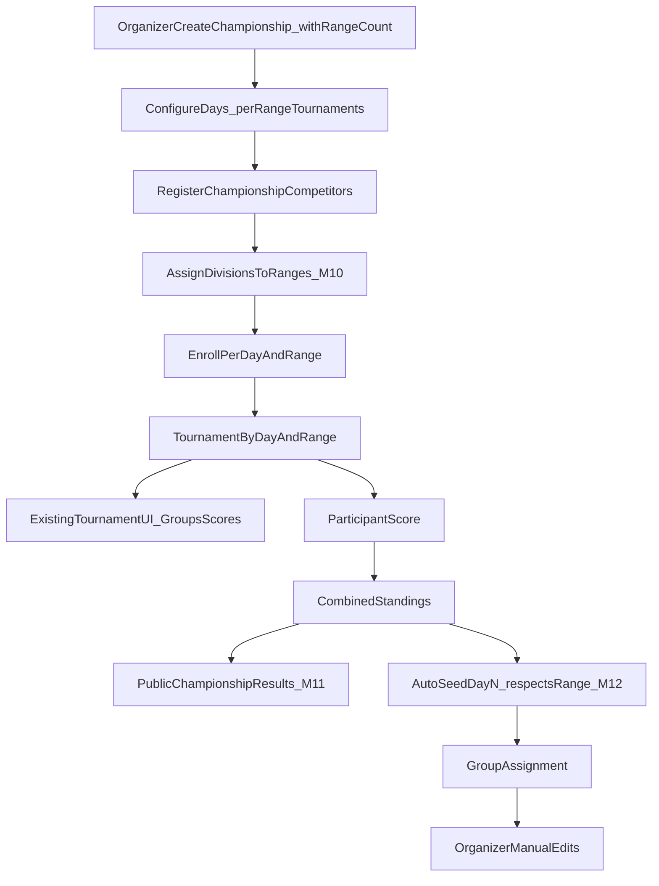

# ADR-0001: Multi-day Competitions via Championships Wrapper

_This document is an ADR entry in the Architecture Decision Log (ADL)._

## Status
Accepted

## Date
2026-04-27

## Context
- **Primary product:** single-day tournaments. Organizers must **always** be able to create and fully manage a standalone tournament without using championships.
- Most events are single-day; that flow must remain first-class and must not regress as championships are added.
- Multi-day events are infrequent (around three per year) and must not increase complexity in the default **My Tournaments** UI.
- We need:
  - per-day execution with existing round/group/score mechanics,
  - combined standings across days,
  - day 2+ pre-seeding from combined standings,
  - organizer override of pre-seeded groups,
  - late joins and participant drops handled explicitly.

## Decision
Implement multi-day events as a separate top-level concept named `Championship`, where each day is an existing `Tournament`.

### Invariant: standalone tournament flow (non-negotiable)
At **no point** — during any milestone or follow-up PR — may championship work break or replace the standalone tournament path.

Organizers must **always** be able to, without opening My Championships:
- create a single-day tournament on **My Tournaments** (`/tournaments`),
- add and edit participants, groups, and scores,
- publish/share and view results,

exactly as today, for any tournament with no `ChampionshipRound` link.

Championship features are **additive** (new routes, actions, and filters). Changes to shared tournament code (participants, groups, scores) must preserve standalone behavior; championship-only logic branches on “is this tournament a championship day?” and must not alter the standalone code path.

Every milestone PR and M14 regression must explicitly verify this invariant.

### Access control: Championship Organizer (TO power-up)
Championship access is **not** a separate role table. It is a **per-club upgrade** on an existing Tournament Organizer (`Organizer`) row.

| Capability | Requirement |
|------------|-------------|
| **Tournament Organizer (TO)** | `Organizer` row for `(userId, club)` — My Tournaments and standalone tournament management for that club. |
| **Championship Organizer (CO)** | Same `Organizer` row with `canManageChampionships = true` (schema default `false`). User must already be a TO for that club before an admin can grant the CO upgrade. |

- Extend `Organizer` with `canManageChampionships Boolean @default(false)`.
- There is no `ChampionshipOrganizer` table and no CO without a TO row for that club.
- All `/championships` routes and championship server actions require at least one `Organizer` with `canManageChampionships` and club scope matching the championship’s `organizerClub`.
- Navigation shows **My Championships** only when the session has at least one such row.
- Admins grant/revoke the CO upgrade on the TOs page per existing organizer club assignment (toggle on the `Organizer` row).
- Session continues to load `organizerRoles`; championship guards filter `organizerRoles` where `canManageChampionships === true` (no duplicate role list on session).
- Day tournament screens (`/tournaments/[tId]`, groups, scores) reached from the championship hub use existing tournament routes; access for championship-linked day tournaments is defined when implementing day links (M6+).

### Core model
- Add `Championship` with `rangeCount` (default `1`) — shooting ranges are a **championship-only** feature; standalone tournaments are unchanged.
- Add `ChampionshipRound` with ordered links to `Tournament` (`dayOrder`, `rangeNumber`, `tournamentId`). Each `(dayOrder, rangeNumber)` pair is one day-tournament. Adding a championship day creates **`rangeCount` tournaments** (one per range).
- Use a single canonical relation (`ChampionshipRound.tournamentId -> Tournament.id`) and do not store a backward FK on `Tournament`.
- Add `ChampionshipDivisionRange` (name TBD): maps a **division** (`equipment category` + `age group` + `gender`) to a `rangeNumber` for a given `dayOrder` (see shooting ranges — M10). Division cohesion is enforced by routing enrollment to the correct range tournament, not by `GroupAssignment` fields on standalone tournaments.
- Add `ChampionshipRegistration` per competitor in a championship: full participant profile (name, age division, equipment category, gender, club, `membershipNo`) plus system-assigned championship `competitorNumber` (see identity rules below).
- On each day enroll, copy the registration profile onto that day’s `Participant` row (`unique(tournamentId, membershipNo)` and `unique(tournamentId, competitorNumber)`).

### Modeling note
- The previous back-reference approach (`Tournament.championshipDayId`) was dropped to avoid dual-source-of-truth synchronization.
- Standalone tournaments are queried through relation-null checks (`championshipRound IS NULL`) instead of scalar `championshipDayId IS NULL`.

### Behavioral rules
- Day 1 groups are manual within each range’s day-tournament (M10).
- Day 2+ groups are auto-seeded from combined standings (M12):
  - organizer chooses **first target** and **number of targets to fill** for the day’s format.
  - per division with ≥ `groupSize` shooters: keep standing blocks together (example `groupSize=4`: seeds `1–4`, `5–8`, … each on one target).
  - divisions with fewer than `groupSize` shooters are combined on shared targets with other small divisions.
  - units are balanced across the selected target range (least-loaded target first).
  - seeding **must respect ranges (M10):** seed only into the day-tournament for the range where that division is assigned for that day; never split a division across range tournaments.
  - only archers enrolled on the target day are seeded; fewer day-2 shooters than day-1 is normal.
  - prior-day DNC/DNF sort after completed scores (last in their target group); missing prior scores or day-2-only enrollments sort after that.
- After auto-seed, organizers can fully edit groups in normal group assignment UI.
- **Day order is fixed when a day is added** (`dayOrder` = next sequential integer). Reordering days after the fact is not supported (day 2+ seeding and combined standings depend on stable order).
- Late join on day `N`:
  - default prior-day backfill is DNC (`setDNC`) for days `< N`.
- Drop handling:
  - no automatic DNC for later days,
  - organizer can run bulk action to set DNC on remaining days.

### Visibility rules
- **My Tournaments** (`/tournaments`) lists only standalone tournaments: `championshipRound IS NULL` (M3, `standaloneTournamentWhere` on `listTournamentsForClubs`).
- The same guard applies to other default tournament browse surfaces (e.g. results tournament picker).
- Championship day tournaments are **not** listed on My Tournaments. Organizers reach them only from **My Championships** (day links to `/tournaments/[tId]`, groups, scores). Direct URL to a day tournament still works when linked from the championship hub.
- **Attaching an existing club tournament as a championship day is not supported.** A day is always created as a new `Tournament` when adding a championship day (M6).

### Organizer workflow (product surface)
Organizers must be able to run a multi-day event end-to-end in the app without manual database steps.

1. **Create championship** — name + organizer club + **number of ranges** (`rangeCount`, default 1).
2. **Configure days** — append championship days in order; each day creates **`rangeCount` tournaments** and `ChampionshipRound` rows (`dayOrder` × `rangeNumber`); remove a day only when appropriate (detach all range tournaments for that day).
3. **Register championship competitors** — add rows to `ChampionshipRegistration` with the full participant profile (same fields as a day `Participant` except day-specific check-in) plus system-assigned `competitorNumber`.
4. **Assign divisions to ranges (M10)** — before the first day-1 enrollment, configure the category–range matrix (see shooting ranges). Required gate for enrollment.
5. **Enroll into days** — per day and range: create `Participant` rows only on the day-tournament for that range when the competitor’s division is assigned to that range for that day.
6. **Run each day** — from the championship detail, open tournament flows per range: participants, **groups**, **scores** (existing `/tournaments/[tId]` UI; one tournament per range).
7. **Later milestones** — combined standings (M9 ✓), shooting ranges (M10 ✓), public championship results (M11), day 2+ auto-seed (M12), late join/drop (M13).

Day execution deliberately reuses the standalone tournament engine; the championship layer orchestrates identity, enrollment, and cross-day logic.

### Identity: `membershipNo` vs `competitorNumber`
These are **different fields**; do not conflate them.

| Field | Meaning | Scope |
|-------|---------|--------|
| `membershipNo` | External association membership number for the archer (IFAA / national body). | Global to the archer; same value in standalone tournaments and championships. |
| `competitorNumber` | Championship bib ID assigned by the system at **championship registration** (`max + 1` within that championship). | Unique per championship; copied to each enrolled day’s `Participant`. |

- `membershipNo` links the same person across days for combined standings and roster lookup.
- `competitorNumber` is the printed/event number for that championship only (badges, day lists, seed blocks by standing position vs bib are separate concerns).
- **`membershipNo` ≠ `competitorNumber`** — values and types differ; enrollment must set each field from the correct source on `ChampionshipRegistration`.

### Enrollment rules
- A competitor must be in `ChampionshipRegistration` before enrollment into any day.
- **M10 gate:** a competitor may be enrolled on `(dayOrder, rangeNumber)` only if their division is assigned to that `rangeNumber` for that `dayOrder` in `ChampionshipDivisionRange`. Divisions with no range assignment cannot be enrolled on any day-tournament.
- On enroll, copy from registration to the **range’s** day-tournament `Participant` (profile + identity):
  - `Participant.name`, `ageGroupId`, `categoryId`, `club`, `genderGroup` ← registration
  - `Participant.membershipNo` ← `ChampionshipRegistration.membershipNo`
  - `Participant.competitorNumber` ← `ChampionshipRegistration.competitorNumber`
- Profile edits at championship level update `ChampionshipRegistration`; re-enroll or sync rules for already-enrolled days are documented in the runbook (M14).
- One `Participant` per `(tournamentId, membershipNo)` per range day-tournament; re-enroll on the same day/range is an update, not a duplicate.
- Enrolling on day `N` without prior day rows does not auto-create participants on earlier days (late join / DNC backfill remains M13).
- Unenroll from a day/range: remove `Participant` (and dependent group/score rows) without removing `ChampionshipRegistration`.
- **Unassign division from a range (M10):** automatically unenroll all roster members in that division from every day-tournament for that range (and from other ranges if the unassignment removes their only valid range for that day — product rule: unassigning a division from a range unenrolls all affected participants from day enrollments tied to that assignment).

### Shooting ranges (championship-only — M10)
**Standalone tournaments:** no range concept; no schema or UI changes to My Tournaments create/group/score flows.

| Term | Meaning |
|------|---------|
| **Range** | Physical shooting range at the venue (`rangeNumber` 1…`Championship.rangeCount`). Optional display names are a later enhancement. |
| **Day-tournament** | One normal `Tournament` per `(dayOrder, rangeNumber)` — the existing tournament engine runs unchanged inside each range tournament. |
| **Division** | `equipment category` + `age group` + `gender` (same key as category scoring). |

**Championship setup**
- `Championship.rangeCount` set at create (and editable only while rules allow — e.g. before days exist / no scores).
- Adding championship **day** `D` creates `rangeCount` tournaments and `ChampionshipRound` rows for `(D, 1)…(D, rangeCount)`.

**Category–range assignment (required before first day-1 enrollment)**
- UI: matrix of divisions with **registration counts**; **Cub divisions listed first** (guardian-on-range planning).
- Organizer assigns each division to exactly one range per `dayOrder` (day 1 initially); show **running totals per range** for assigned divisions.
- **Multiple divisions may share one range.** A division is never split across ranges for the same `dayOrder`.
- **Enrollment:** only divisions assigned to range `R` may be enrolled on day `D` range `R`’s tournament.
- **Unassign division from range:** unenroll all competitors in that division from affected day-tournaments (see enrollment rules).

**Freeze and day 2+ moves**
- **Freeze trigger:** any score entered on any **day-1** range tournament locks the day-1 division↔range assignment matrix (no adding/removing divisions from ranges for day 1).
- **Day 2+:** division↔range assignment is per `dayOrder`. Changing a division’s range for day `N` moves the **full division** to that range’s day-`N` tournament (bulk unenroll from the old range day-tournament, re-enroll eligible on the new one). Individual archers do not straddle ranges within a day.
- **Cross-day archer rule (day 2+):** an archer must not shoot on a range in a later day if that `membershipNo` already competed on that same `rangeNumber` on an earlier day (enforced via division moves and enrollment guards).

**Scoring and results**
- **Groups / score by group:** unchanged within each range’s tournament (`/tournaments/[tId]`).
- **Score by category**, **combined standings (M9)**, **public results**, **IFAF export:** aggregate across range tournaments for the day/championship; ranges are not surfaced (end-of-day scores only; IFAF export unchanged).

**Auto-seed (M12):** must respect per-day division↔range assignments — seed into the correct range’s day-tournament only.

**Migration:** existing championships behave as `rangeCount = 1`; each historical day gains a single round row with `rangeNumber = 1`. Update unique constraint on `ChampionshipRound` from `(championshipId, dayOrder)` to `(championshipId, dayOrder, rangeNumber)`.

## Alternatives considered

### Rejected: Embed days inside `Tournament`
- Would require new day-specific score/group models and broad refactors in core tournament actions and screens.
- Higher regression risk for the primary single-day workflow.
- Larger PRs and harder review path.

### Rejected: Attach existing My Tournaments entry as a championship day
- Would blur standalone vs championship lifecycle and bypass the M3 list guardrail in the UI.
- Day tournaments are always created through the championship day flow (M6).

### Rejected: Reorder championship days after creation
- No product requirement; `dayOrder` is assigned at add time and must stay stable for day 2+ auto-seed and combined standings.
- Do not add reorder UI. Remove dead server code in a follow-up PR (see below).

### Rejected: Ranges as a field on standalone `Tournament`
- Would complicate the primary single-day workflow and duplicate concepts already expressed by one tournament per range.
- Ranges are modeled only on `Championship` via multiple day-tournaments per `(dayOrder, rangeNumber)`.

## Follow-up PR (championship cleanup)
- **Remove `reorderRounds`** from `src/app/championships/championshipActions.ts` (shipped in M2, never used by UI or tests).
- Confirm `addRoundTournament` / day-create flow only assigns the next sequential `dayOrder`.

## Follow-up PR (championship days UX)
- **Add-day default date:** when opening Add day, pre-fill the date picker with the day after the latest existing day’s `Tournament.date` (not `new Date()` / today). First day may still default to today or another agreed rule.
- **Day card shows date:** on championship detail, each day card in `ChampionshipRoundsList` should display the linked tournament date (format consistently with `TournamentDayPicker` / elsewhere).

## Consequences

### Positive
- Reuses existing tournament engine for each day (round formats, groups, scoring, publishing).
- Keeps default tournament workflows simple.
- Enables incremental rollout with low compatibility risk.

### Trade-offs
- Requires cross-day identity layer (`ChampionshipRegistration`).
- Needs orchestration logic for combined standings and seeding.

## Backward compatibility
- **Standalone tournaments are the default and must remain fully supported forever** (see invariant above).
- Existing standalone data and flows are unchanged. Championship day tournaments are created only through the championship day flow (M6), not by repurposing entries from My Tournaments.
- No breaking changes to core create/participant/group/score/publish/results actions for tournaments where `championshipRound` is null.
- Championship behavior is introduced via new actions and UI surfaces (`/championships`, …), not by removing or gating `/tournaments`.

## Implementation milestones

Each milestone after M4 delivers **incremental organizer-facing functionality** verifiable through the UI (no “engine-only” or read-only slices). Server actions may land in the same PR as their milestone UI or in M2 when already present.

**Versioning:** bump the **patch** version in `package.json` (semver `MAJOR.MINOR.PATCH`) in the same PR that delivers each milestone (M1–M14). Example: after M5 ships, `1.4.0` → `1.4.1`.

**Every milestone (M1–M14)** must leave the standalone tournament invariant true; championship work must not be merged if My Tournaments create/manage/regress fails.

M1–M5 are delivered in code (including Championship Organizer power-up on `Organizer.canManageChampionships`).

### M1 — Schema foundation (no behavior change) ✓
- Add schema objects:
  - `Championship`
  - `ChampionshipRound`
  - `ChampionshipRegistration`
- Add indexes for round lookups and championship ordering.
- Migration default: existing tournaments remain standalone by having no linked championship round rows.

### M2 — Championship server actions ✓
- Championship CRUD + day attach/detach actions (`dayOrder` set at create; no reorder).
- `registerChampionshipParticipant` (championship roster).
- Enforce transactional integrity on `ChampionshipRound` creation/removal with linked tournament references.
- Additional actions (day enrollment, combined standings, ranges, public results, auto-seed, late join) ship with their UI milestone (M8, M9, M10, M11, M12, M13).

### M3 — Standalone tournament list guardrail ✓
- Default tournament list queries use `championshipRound IS NULL` (`standaloneTournamentWhere` in `listTournamentsForClubs` and results browse).
- Championship-scoped queries list day tournaments only under championships (`listChampionshipDayTournaments` / championship detail includes).
- **UI test:** create or link a championship day tournament → it does **not** appear on My Tournaments → it **does** appear on the championship detail day list.

### M4 — My Championships browse shell and Championship Organizer gate ✓
- List and detail pages; day list with order and deep link to each day’s tournament overview (`/tournaments/[tId]`).
- `Organizer.canManageChampionships` (`Boolean`, default `false`) — CO power-up on existing TO row per club.
- Gate all `/championships` pages and championship server actions on CO clubs.
- Navigation: **My Championships** only when at least one `canManageChampionships` row.
- Admin (TOs page): toggle CO upgrade per club on existing TO row.
- **UI tests:**
  - **TO only:** no My Championships nav; `/championships` unauthorized; My Tournaments works.
  - **TO + CO** for club X: My Championships and championships for X; open linked day tournament.
  - **No TO rows:** both areas blocked.

### M5 — Create and edit championships ✓
- “New championship” on `/championships` (name + club from TO rows where `canManageChampionships`); wire to `createChampionship` / `updateChampionship`.
- **M10 extends:** `rangeCount` on create/edit (default 1 for migrated championships).
- Server actions: CO guard (TO + `canManageChampionships` for club; same as M4).
- Edit championship name on detail page.
- **UI test:** create a championship → appears on list → rename on detail → name persists on reload.

### M6 — Configure championship days ✓
- Add day: create a new `Tournament` for the day (reuse tournament create fields) and link via `ChampionshipRound` with the next `dayOrder` (append only).
- **M10 extends:** each added day creates **`rangeCount` tournaments** and round links `(dayOrder, rangeNumber)`; day list shows ranges under each day.
- Remove day link when allowed (e.g. no scores yet — document rules in runbook); optional day label.
- Day list shows fixed order, label, tournament name, and links to overview, **groups**, and **scores** for each day (per range after M10).
- **UI test:** add two days in sequence → day numbers are 1 then 2 → open groups/scores from championship detail → remove a day link (per rules).

### M7 — Championship competitor roster ✓
- Register competitors with full participant profile (`membershipNo`, name, division, category, gender, club) → system `competitorNumber`; list roster on championship detail.
- Remove registration only when not enrolled on any day (document cascade in runbook).
- **UI test:** register two competitors with full profiles → see names, numbers, and divisions → remove one not enrolled on any day.

### M8 — Enroll competitors into days ✓
- Day enrollment actions: create/update `Participant` on the day tournament by copying all fields from `ChampionshipRegistration` (see enrollment rules).
- Per day: show enrolled vs registered-not-enrolled; single/bulk enroll (no profile form at enroll unless registration is edited separately).
- Unenroll from a day without removing championship registration.
- **M10 extends:** enrollment is per **day × range** tournament; gated by division↔range assignment.
- **UI test:** enroll roster members on day 1 → they appear on that day’s tournament participants → unenroll one → championship registration unchanged.

### Participant naming policy
- **Cross-day person key:** `membershipNo` (association ID) — used to aggregate combined standings and find the same archer across championship days.
- **Championship bib:** `competitorNumber` on `ChampionshipRegistration`, assigned at roster registration (`max + 1` within the championship), immutable, copied to each enrolled day’s `Participant`.
- **Display name** in combined views: `ChampionshipRegistration.name` (source of truth at registration); enrolled day `Participant.name` is a copy at enroll time.

### M9 — Combined standings (organizer view) ✓
- Combined standings library and actions (sum raw scores, current tie semantics; `membershipNo` identity).
- Championship detail section: combined standings table (updates as day scores are entered).
- **UI test:** two days with enrolled competitors and scores → combined standings on championship detail match manual calculation.

### M10 — Championship shooting ranges (championship-only) ✓
- Schema: `Championship.rangeCount`; `ChampionshipRound.rangeNumber`; `ChampionshipDivisionRange` (`championshipId`, `dayOrder`, division key, `rangeNumber`).
- Create/edit championship: **number of ranges** (default 1). Standalone tournament create unchanged.
- Add day: create **`rangeCount` day-tournaments** per day; hub lists day → range → tournament links.
- **Category–range matrix** (before first day-1 enrollment): divisions with counts, Cubs first, per-range totals, assign/unassign with enrollment side effects.
- **Freeze** day-1 matrix after any day-1 score; **day 2+** move whole divisions between range tournaments per day.
- Enrollment/guards: division must be assigned to range; cross-day same-range archer guard for day 2+.
- Combined standings / category scoring / IFAF: unchanged aggregation across range tournaments.
- **UI test:** championship with 2 ranges and 2 divisions → matrix assign → enroll only on matching range day-tournament → day-1 score freezes matrix → day-2 move whole division to other range tournament → category standings still aggregate.

### M11 — Public championship results (optional)
- Public results route composing per-day and combined views.
- Existing per-tournament publish/share unchanged.
- **UI test:** publish/share championship results URL → spectator sees per-day and combined tables.

### M12 — Day 2+ auto-seed ✓
- Auto-seed from combined standings with organizer-chosen target range (first target + count), standing blocks kept together, small divisions combined, load balanced across targets.
- **Must respect ranges (M10):** seed into the day-tournament for each division’s assigned range for that `dayOrder`; never split a division across range tournaments.
- Organizer control on championship detail: run auto-seed **per range** for a day before/at group setup (each range tournament has its own target range).
- Post-seed editing remains in existing `/tournaments/[tId]/groups` UI.
- **UI test:** enter day 1 scores → run auto-seed for day 2 → open day 2 groups → groups match seed rules and range rules → manual edit persists until re-seed.

### M13 — Late join and drop
- Late join: register at championship level if needed, enroll on day `N`, prior-day DNC backfill for days `< N`.
- Drop: unenroll or mark inactive on later days; bulk DNC on remaining days (no automatic DNC on drop alone).
- **UI test:** late join on day 2 → prior day shows DNC → drop with bulk DNC on day 3+ only when action run.

### M14 — Hardening and runbook
- Integration/regression coverage for M4–M13 paths.
- Runbook + local dev seed (sample championship with days, roster, enrollments, multi-range day) so milestones are testable without manual SQL.
- **Mandatory regression suite:** full standalone path (create tournament → participants → groups → scores → publish/results) with no championship involvement.

## Test and acceptance criteria

### Global (all milestones)
- **Standalone invariant:** an organizer with no championships can create a new tournament on My Tournaments and complete the full single-day lifecycle (participants, groups, scores, publish/results) with no championship UI required and no behavior change from pre-championship baseline.
- Championship work must not add required steps, fields, or navigation to standalone tournament screens.

### Per milestone
- **M3:** championship day tournaments excluded from My Tournaments list; visible on championship detail only.
- **M4:** CO power-up enforced on `Organizer`; TO without `canManageChampionships` cannot access `/championships`; TO+CO can browse and open linked day tournaments.
- **M5:** create and rename championships in UI.
- **M6:** append days in fixed order, remove day when allowed; jump to groups/scores from championship detail.
- **M7:** register championship roster with full profile and stable competitor numbers.
- **M8:** enroll/unenroll on days; day `Participant` has registration `membershipNo` and registration `competitorNumber` (distinct fields).
- **M9:** combined standings on championship detail match manual totals across days.
- **M10:** championship `rangeCount`; one tournament per `(day, range)`; category–range matrix; enrollment gates; day-1 freeze; day-2+ whole-division range moves; standalone tournaments unchanged.
- **M11:** public championship results page shows per-day and combined views.
- **M12:** day 2+ auto-seed produces correct groups in the correct range day-tournament; manual override in tournament groups UI works.
- **M13:** late join backfills DNC; drop does not auto-DNC; bulk DNC action works.
- **M14:** runbook seed reproduces M4–M9 smoke path; documented standalone regression checklist passes.

## Decision diagram

