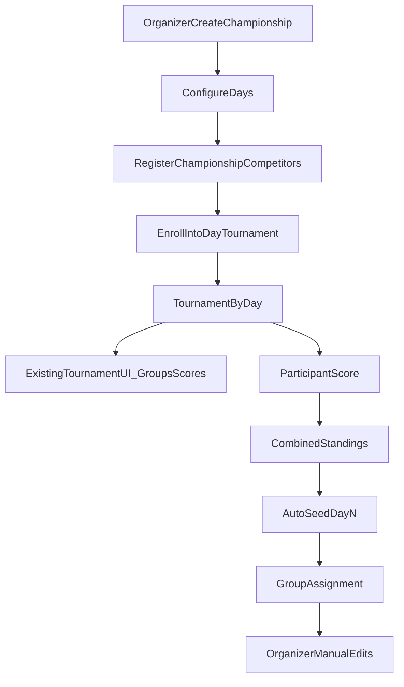

# ADR-0001: Multi-day Competitions via Championships Wrapper

_This document is an ADR entry in the Architecture Decision Log (ADL)._

## Status
Accepted

## Date
2026-04-27

## Context
- **Primary product:** single-day tournaments. Organizers must **always** be able to create and fully manage a standalone tournament without using championships.
- Most events are single-day; that flow must remain first-class and must not regress as championships are added.
- Multi-day events are infrequent (around three per year) and must not increase complexity in the default **My Tournaments** UI.
- We need:
  - per-day execution with existing round/group/score mechanics,
  - combined standings across days,
  - day 2+ pre-seeding from combined standings,
  - organizer override of pre-seeded groups,
  - late joins and participant drops handled explicitly.

## Decision
Implement multi-day events as a separate top-level concept named `Championship`, where each day is an existing `Tournament`.

### Invariant: standalone tournament flow (non-negotiable)
At **no point** — during any milestone or follow-up PR — may championship work break or replace the standalone tournament path.

Organizers must **always** be able to, without opening My Championships:
- create a single-day tournament on **My Tournaments** (`/tournaments`),
- add and edit participants, groups, and scores,
- publish/share and view results,

exactly as today, for any tournament with no `ChampionshipRound` link.

Championship features are **additive** (new routes, actions, and filters). Changes to shared tournament code (participants, groups, scores) must preserve standalone behavior; championship-only logic branches on “is this tournament a championship day?” and must not alter the standalone code path.

Every milestone PR and M13 regression must explicitly verify this invariant.

### Access control: Championship Organizer (TO power-up)
Championship access is **not** a separate role table. It is a **per-club upgrade** on an existing Tournament Organizer (`Organizer`) row.

| Capability | Requirement |
|------------|-------------|
| **Tournament Organizer (TO)** | `Organizer` row for `(userId, club)` — My Tournaments and standalone tournament management for that club. |
| **Championship Organizer (CO)** | Same `Organizer` row with `canManageChampionships = true` (schema default `false`). User must already be a TO for that club before an admin can grant the CO upgrade. |

- Extend `Organizer` with `canManageChampionships Boolean @default(false)`.
- There is no `ChampionshipOrganizer` table and no CO without a TO row for that club.
- All `/championships` routes and championship server actions require at least one `Organizer` with `canManageChampionships` and club scope matching the championship’s `organizerClub`.
- Navigation shows **My Championships** only when the session has at least one such row.
- Admins grant/revoke the CO upgrade on the TOs page per existing organizer club assignment (toggle on the `Organizer` row).
- Session continues to load `organizerRoles`; championship guards filter `organizerRoles` where `canManageChampionships === true` (no duplicate role list on session).
- Day tournament screens (`/tournaments/[tId]`, groups, scores) reached from the championship hub use existing tournament routes; access for championship-linked day tournaments is defined when implementing day links (M6+).

### Core model
- Add `Championship`.
- Add `ChampionshipRound` with ordered links to `Tournament` (`dayOrder`, `tournamentId`).
- Use a single canonical relation (`ChampionshipRound.tournamentId -> Tournament.id`) and do not store a backward FK on `Tournament`.
- Add `ChampionshipRegistration` per competitor in a championship: association `membershipNo` plus system-assigned championship `competitorNumber` (see identity rules below).
- On each day enroll, copy both onto that day’s `Participant` row (`unique(tournamentId, membershipNo)` and `unique(tournamentId, competitorNumber)`).

### Modeling note
- The previous back-reference approach (`Tournament.championshipDayId`) was dropped to avoid dual-source-of-truth synchronization.
- Standalone tournaments are queried through relation-null checks (`championshipRound IS NULL`) instead of scalar `championshipDayId IS NULL`.

### Behavioral rules
- Day 1 groups are manual.
- Day 2+ groups are auto-seeded from combined standings using adjacent blocks:
  - example (`groupSize=4`): `1-4`, `5-8`, `9-12`.
- Tail handling:
  - rebalance tail blocks to maximize full groups,
  - if still impossible, allow a smaller final group (example: `1-4`, `5-7`).
- After auto-seed, organizers can fully edit groups in normal group assignment UI.
- **Day order is fixed when a day is added** (`dayOrder` = next sequential integer). Reordering days after the fact is not supported (day 2+ seeding and combined standings depend on stable order).
- Late join on day `N`:
  - default prior-day backfill is DNC (`setDNC`) for days `< N`.
- Drop handling:
  - no automatic DNC for later days,
  - organizer can run bulk action to set DNC on remaining days.

### Visibility rules
- **My Tournaments** (`/tournaments`) lists only standalone tournaments: `championshipRound IS NULL` (M3, `standaloneTournamentWhere` on `listTournamentsForClubs`).
- The same guard applies to other default tournament browse surfaces (e.g. results tournament picker).
- Championship day tournaments are **not** listed on My Tournaments. Organizers reach them only from **My Championships** (day links to `/tournaments/[tId]`, groups, scores). Direct URL to a day tournament still works when linked from the championship hub.
- **Attaching an existing club tournament as a championship day is not supported.** A day is always created as a new `Tournament` when adding a championship day (M6).

### Organizer workflow (product surface)
Organizers must be able to run a multi-day event end-to-end in the app without manual database steps.

1. **Create championship** — name + organizer club (from session roles).
2. **Configure days** — append championship days in order; each day creates a new `Tournament` and `ChampionshipRound` link; remove a day only when appropriate (detach).
3. **Register championship competitors** — add rows to `ChampionshipRegistration` (stable `membershipNo`, system-assigned `competitorNumber`).
4. **Enroll into days** — for a selected day, create `Participant` rows on that day’s tournament for registered competitors (profile fields: entered at enroll or copied from the competitor’s latest participant row in this championship).
5. **Run each day** — from the championship detail, open the existing tournament flows for that day: participants, **groups** (`/tournaments/[tId]/groups`), **scores** (`/tournaments/[tId]/scores`). No duplicate group/score UIs under `/championships`.
6. **Later milestones** — combined standings, day 2+ auto-seed, late join/drop, optional public results (M9–M12).

Day execution deliberately reuses the standalone tournament engine; the championship layer orchestrates identity, enrollment, and cross-day logic.

### Identity: `membershipNo` vs `competitorNumber`
These are **different fields**; do not conflate them.

| Field | Meaning | Scope |
|-------|---------|--------|
| `membershipNo` | External association membership number for the archer (IFAA / national body). | Global to the archer; same value in standalone tournaments and championships. |
| `competitorNumber` | Championship bib ID assigned by the system at **championship registration** (`max + 1` within that championship). | Unique per championship; copied to each enrolled day’s `Participant`. |

- `membershipNo` links the same person across days for combined standings and roster lookup.
- `competitorNumber` is the printed/event number for that championship only (badges, day lists, seed blocks by standing position vs bib are separate concerns).
- **`membershipNo` ≠ `competitorNumber`** — values and types differ; enrollment must set each field from the correct source on `ChampionshipRegistration`.

### Enrollment rules
- A competitor must be in `ChampionshipRegistration` before enrollment into any day.
- On enroll, copy from registration to day `Participant`:
  - `Participant.membershipNo` ← `ChampionshipRegistration.membershipNo`
  - `Participant.competitorNumber` ← `ChampionshipRegistration.competitorNumber`
- One `Participant` per `(tournamentId, membershipNo)` per day; re-enroll on the same day is an update, not a duplicate.
- Enrolling on day `N` without prior day rows does not auto-create participants on earlier days (late join / DNC backfill remains M11).
- Unenroll from a day: remove `Participant` (and dependent group/score rows per existing tournament delete rules) without removing `ChampionshipRegistration`.

## Alternatives considered

### Rejected: Embed days inside `Tournament`
- Would require new day-specific score/group models and broad refactors in core tournament actions and screens.
- Higher regression risk for the primary single-day workflow.
- Larger PRs and harder review path.

### Rejected: Attach existing My Tournaments entry as a championship day
- Would blur standalone vs championship lifecycle and bypass the M3 list guardrail in the UI.
- Day tournaments are always created through the championship day flow (M6).

### Rejected: Reorder championship days after creation
- No product requirement; `dayOrder` is assigned at add time and must stay stable for day 2+ auto-seed and combined standings.
- Do not add reorder UI. Remove dead server code in a follow-up PR (see below).

## Follow-up PR (championship cleanup)
- **Remove `reorderRounds`** from `src/app/championships/championshipActions.ts` (shipped in M2, never used by UI or tests).
- Confirm `addRoundTournament` / day-create flow only assigns the next sequential `dayOrder`.

## Consequences

### Positive
- Reuses existing tournament engine for each day (round formats, groups, scoring, publishing).
- Keeps default tournament workflows simple.
- Enables incremental rollout with low compatibility risk.

### Trade-offs
- Requires cross-day identity layer (`ChampionshipRegistration`).
- Needs orchestration logic for combined standings and seeding.

## Backward compatibility
- **Standalone tournaments are the default and must remain fully supported forever** (see invariant above).
- Existing standalone data and flows are unchanged. Championship day tournaments are created only through the championship day flow (M6), not by repurposing entries from My Tournaments.
- No breaking changes to core create/participant/group/score/publish/results actions for tournaments where `championshipRound` is null.
- Championship behavior is introduced via new actions and UI surfaces (`/championships`, …), not by removing or gating `/tournaments`.

## Implementation milestones

Each milestone after M4 delivers **incremental organizer-facing functionality** verifiable through the UI (no “engine-only” or read-only slices). Server actions may land in the same PR as their milestone UI or in M2 when already present.

**Every milestone (M1–M13)** must leave the standalone tournament invariant true; championship work must not be merged if My Tournaments create/manage/regress fails.

M1–M4 are delivered in code (including Championship Organizer power-up on `Organizer.canManageChampionships`).

### M1 — Schema foundation (no behavior change) ✓
- Add schema objects:
  - `Championship`
  - `ChampionshipRound`
  - `ChampionshipRegistration`
- Add indexes for round lookups and championship ordering.
- Migration default: existing tournaments remain standalone by having no linked championship round rows.

### M2 — Championship server actions ✓
- Championship CRUD + day attach/detach actions (`dayOrder` set at create; no reorder).
- `registerChampionshipParticipant` (championship roster).
- Enforce transactional integrity on `ChampionshipRound` creation/removal with linked tournament references.
- Additional actions (day enrollment, combined standings, auto-seed, late join) ship with their UI milestone (M8, M9, M10, M11).

### M3 — Standalone tournament list guardrail ✓
- Default tournament list queries use `championshipRound IS NULL` (`standaloneTournamentWhere` in `listTournamentsForClubs` and results browse).
- Championship-scoped queries list day tournaments only under championships (`listChampionshipDayTournaments` / championship detail includes).
- **UI test:** create or link a championship day tournament → it does **not** appear on My Tournaments → it **does** appear on the championship detail day list.

### M4 — My Championships browse shell and Championship Organizer gate ✓
- List and detail pages; day list with order and deep link to each day’s tournament overview (`/tournaments/[tId]`).
- `Organizer.canManageChampionships` (`Boolean`, default `false`) — CO power-up on existing TO row per club.
- Gate all `/championships` pages and championship server actions on CO clubs.
- Navigation: **My Championships** only when at least one `canManageChampionships` row.
- Admin (TOs page): toggle CO upgrade per club on existing TO row.
- **UI tests:**
  - **TO only:** no My Championships nav; `/championships` unauthorized; My Tournaments works.
  - **TO + CO** for club X: My Championships and championships for X; open linked day tournament.
  - **No TO rows:** both areas blocked.

### M5 — Create and edit championships
- “New championship” on `/championships` (name + club from TO rows where `canManageChampionships`); wire to `createChampionship` / `updateChampionship`.
- Server actions: CO guard (TO + `canManageChampionships` for club; same as M4).
- Edit championship name on detail page.
- **UI test:** create a championship → appears on list → rename on detail → name persists on reload.

### M6 — Configure championship days
- Add day: create a new `Tournament` for the day (reuse tournament create fields) and link via `ChampionshipRound` with the next `dayOrder` (append only).
- Remove day link when allowed (e.g. no scores yet — document rules in runbook); optional day label.
- Day list shows fixed order, label, tournament name, and links to overview, **groups**, and **scores** for each day.
- **UI test:** add two days in sequence → day numbers are 1 then 2 → open groups/scores from championship detail → remove a day link (per rules).

### M7 — Championship competitor roster
- Register competitors (`membershipNo` → system `competitorNumber`); list roster on championship detail.
- Remove registration only when not enrolled on any day (document cascade in runbook).
- **UI test:** register two competitors → see assigned competitor numbers → remove one not enrolled on any day.

### M8 — Enroll competitors into days
- Day enrollment actions: create/update `Participant` on the day tournament from `ChampionshipRegistration` (copy `membershipNo` and `competitorNumber` separately — see identity rules).
- Per day: show enrolled vs registered-not-enrolled; single/bulk enroll; profile form at enroll or copy from latest in-championship `Participant` for that `membershipNo`.
- Unenroll from a day without removing championship registration.
- **UI test:** enroll roster members on day 1 → they appear on that day’s tournament participants → unenroll one → championship registration unchanged.

### Participant naming policy
- **Cross-day person key:** `membershipNo` (association ID) — used to aggregate combined standings and find the same archer across championship days.
- **Championship bib:** `competitorNumber` on `ChampionshipRegistration`, assigned at roster registration (`max + 1` within the championship), immutable, copied to each enrolled day’s `Participant`.
- **Display name** in combined views: most recent `Participant.name` for that `membershipNo` on any day of this championship (not a snapshot on `ChampionshipRegistration`).

### M9 — Combined standings (organizer view)
- Combined standings library and actions (sum raw scores, current tie semantics; `membershipNo` identity).
- Championship detail section: combined standings table (updates as day scores are entered).
- **UI test:** two days with enrolled competitors and scores → combined standings on championship detail match manual calculation.

### M10 — Day 2+ auto-seed
- Auto-seed from combined standings (adjacent blocks + tail rebalance).
- Organizer control on championship detail or day tournament: run auto-seed for a day before/at group setup.
- Post-seed editing remains in existing `/tournaments/[tId]/groups` UI.
- **UI test:** enter day 1 scores → run auto-seed for day 2 → open day 2 groups → groups match seed rules → manual edit persists until re-seed.

### M11 — Late join and drop
- Late join: register at championship level if needed, enroll on day `N`, prior-day DNC backfill for days `< N`.
- Drop: unenroll or mark inactive on later days; bulk DNC on remaining days (no automatic DNC on drop alone).
- **UI test:** late join on day 2 → prior day shows DNC → drop with bulk DNC on day 3+ only when action run.

### M12 — Public championship results (optional)
- Public results route composing per-day and combined views.
- Existing per-tournament publish/share unchanged.
- **UI test:** publish/share championship results URL → spectator sees per-day and combined tables.

### M13 — Hardening and runbook
- Integration/regression coverage for M4–M12 paths.
- Runbook + local dev seed (sample championship with days, roster, enrollments) so milestones are testable without manual SQL.
- **Mandatory regression suite:** full standalone path (create tournament → participants → groups → scores → publish/results) with no championship involvement.

## Test and acceptance criteria

### Global (all milestones)
- **Standalone invariant:** an organizer with no championships can create a new tournament on My Tournaments and complete the full single-day lifecycle (participants, groups, scores, publish/results) with no championship UI required and no behavior change from pre-championship baseline.
- Championship work must not add required steps, fields, or navigation to standalone tournament screens.

### Per milestone
- **M3:** championship day tournaments excluded from My Tournaments list; visible on championship detail only.
- **M4:** CO power-up enforced on `Organizer`; TO without `canManageChampionships` cannot access `/championships`; TO+CO can browse and open linked day tournaments.
- **M5:** create and rename championships in UI.
- **M6:** append days in fixed order, remove day when allowed; jump to groups/scores from championship detail.
- **M7:** register championship roster with stable competitor numbers.
- **M8:** enroll/unenroll on days; day `Participant` has registration `membershipNo` and registration `competitorNumber` (distinct fields).
- **M9:** combined standings on championship detail match manual totals across days.
- **M10:** day 2+ auto-seed produces correct groups; manual override in tournament groups UI works.
- **M11:** late join backfills DNC; drop does not auto-DNC; bulk DNC action works.
- **M12:** public championship results page shows per-day and combined views.
- **M13:** runbook seed reproduces M4–M8 smoke path; documented standalone regression checklist passes.

## Decision diagram

